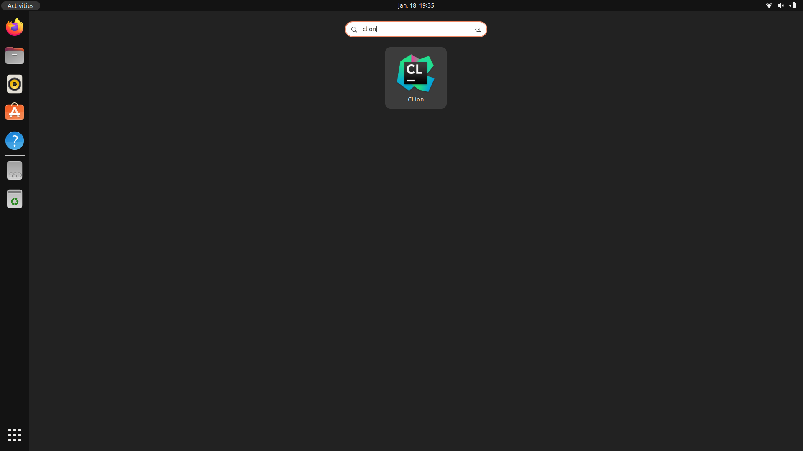
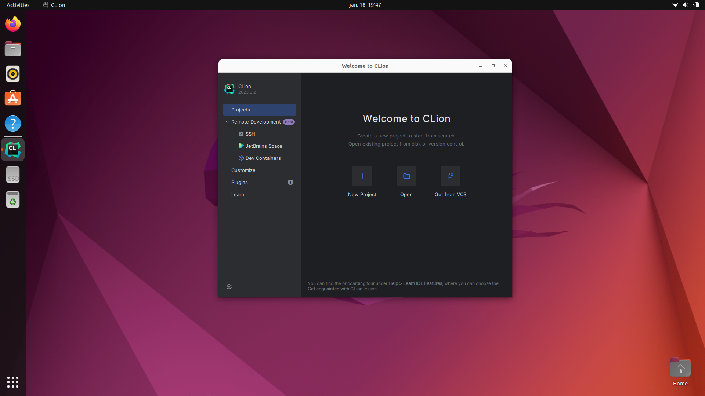
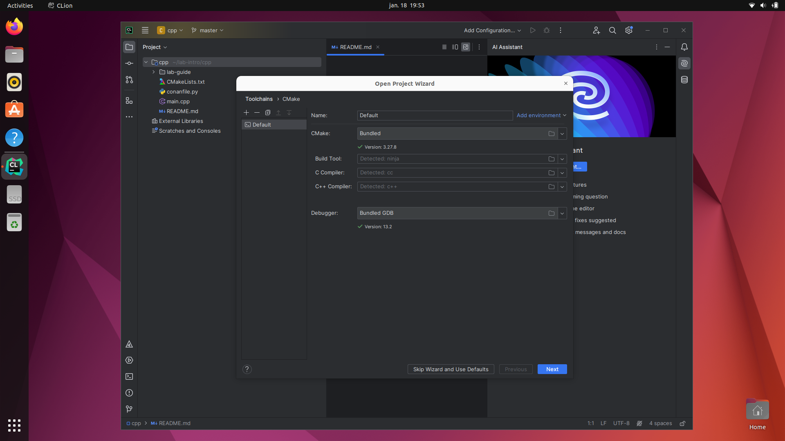
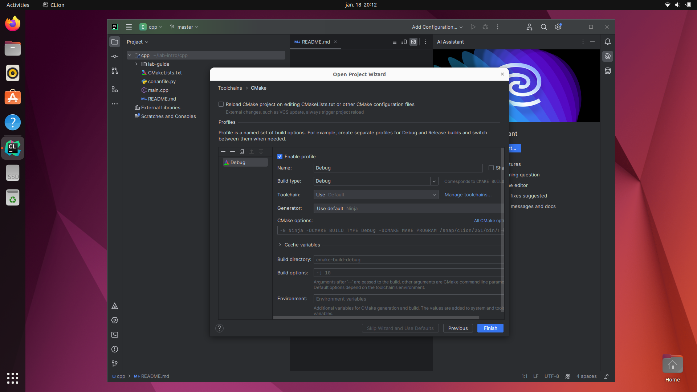
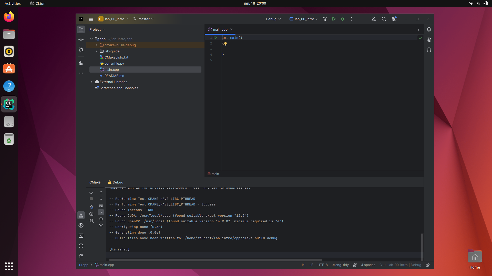

# Step 1: Open the project in CLion
We will in this part download the code from the course repository, and open the project in CLion.

## 1. Clone the code
Open a new terminal by typing <kbd>Ctrl</kbd>+<kbd>Alt</kbd>+<kbd>T</kbd>.

We can clone the lab under this directory by typing the following in the terminal:

```bash
git clone https://github.com/tek5030/lab-intro
```
You should now find the code and this lab guide in `~/lab-intro/cpp`.

## 2. Install dependencies

The lab computers have all required dependencies preinstalled.

If you decide to run the labs on your own computer, please consult the
<a href="https://github.com/tek5030/setup_scripts" target="_blank">tek5030/setup_scripts</a>.   
**We only support Ubuntu 22.04!**

## 3. Open CLion
We will use CLion as IDE in the labs.
As a student, you can get CLion for free from [https://www.jetbrains.com/clion/](https://www.jetbrains.com/clion/).



Open CLion by pressing <kbd>⊞ Win</kbd> and type `clion`. Press <kbd>Enter</kbd>.

## 4. Choose "Open project"


## 5. Find and open the lab project
Open the `CMakeLists.txt` file in the lab directory.

Choose **Open as Project**, and **Trust Project** if a dialog appears.


## 6. Configure project

The very first time you open CLion, you may get asked about toolchains. Just click **Next**.



In the next dialog, we will configure the project.

In later labs, you may want to select _Build type: Release_ in order to speed up your program.

For now, just go with the flow, click **Finish**.   




## 7. We are ready to do some programming!


We are now ready to continue to [the next step](2-acquire-and-display-live-video.md).
