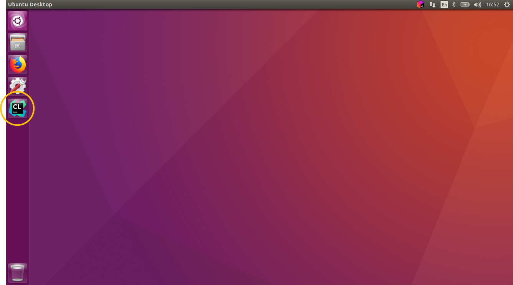
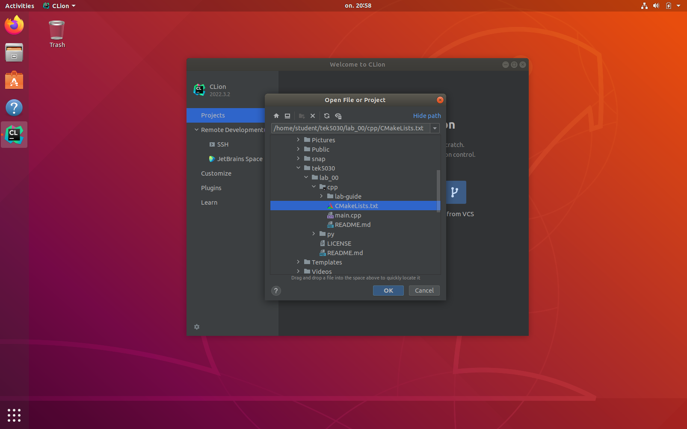
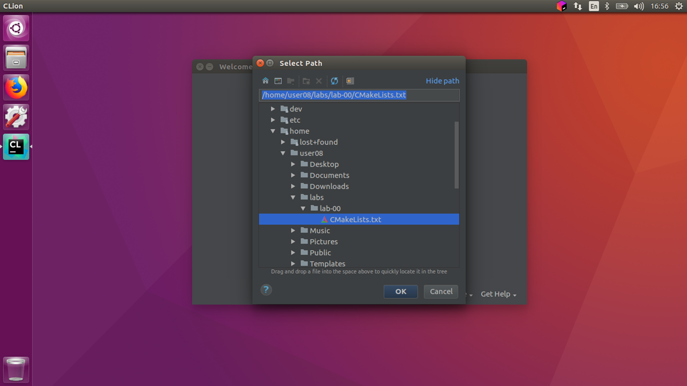
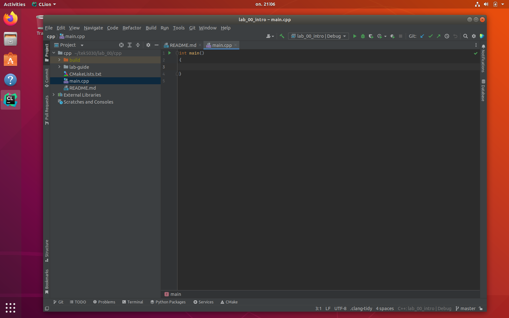

# Step 1: Open the project in CLion
We will in this part download the code from the course repository, and open the project in CLion.

## 1. Clone the code
Clone this repository on your machine.
The lab machines have a directory `labs` under the home directory.
We can clone the lab under this directory by typing the following in the terminal:
```
cd ~/labs
git clone https://github.com/tek5030/lab_00.git
cd lab_00
```
You should now find the code and this lab guide in `~/labs/lab_00`.

## 2. Open CLion
We will use CLion as IDE in the labs.
As a student, you can get CLion for free from [https://www.jetbrains.com/clion/](https://www.jetbrains.com/clion/).



Open CLion by clicking the icon above.

## 3. Choose "Open project"


## 4. Find and open the lab project
Open the `CMakeLists.txt` file in the lab directory.
Choose to open it as a project.



## 5. We are ready to do some programming!


We are now ready to continue to [the next step](2-acquire-and-display-live-video.md).
