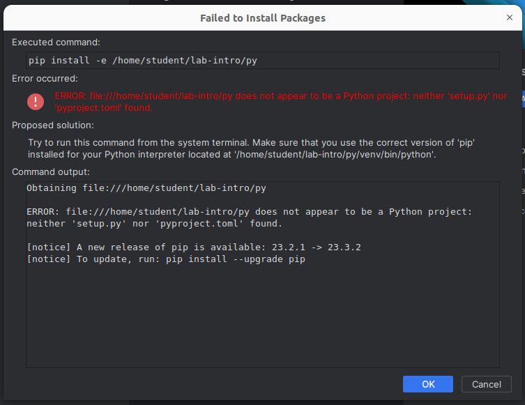
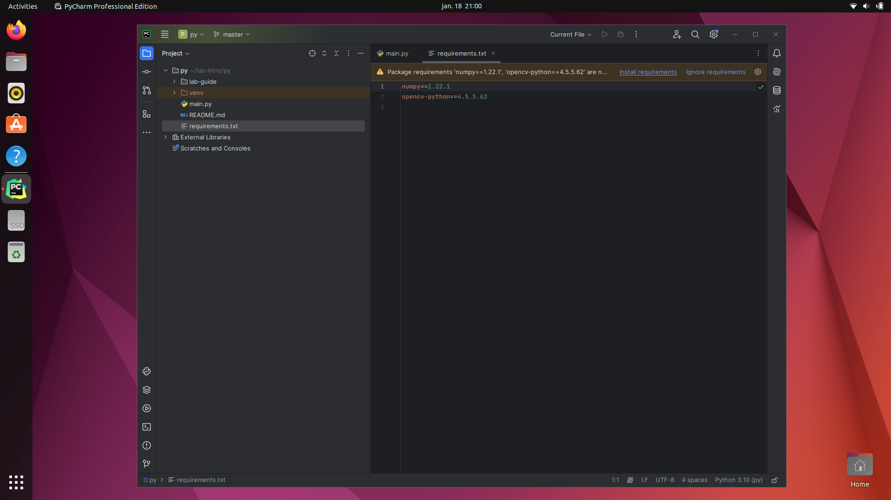

# Step 1: Open the project in PyCharm
We will in this part download the code from the course repository, and open the project in PyCharm.

## 0. Make sure that we have python3 installed

Install the required packages.
```bash
sudo apt update
sudo apt install python3 python3-dev python3-distutils python3-venv python-is-python3
```

## 1. Clone the code
Open a new terminal by typing <kbd>Ctrl</kbd>+<kbd>Alt</kbd>+<kbd>T</kbd>.

We can clone the lab under this directory by typing the following in the terminal:

```bash
git clone https://github.com/tek5030/lab-intro
```
You should now find the code and this lab guide in `~/lab-intro`.
The C++ version is in the subfolder called `cpp`,
and the Python version in the subfolder called `py`. 

## 2. Open PyCharm
We will use PyCharm as IDE in the labs.
As a student, you can get it for free from [https://www.jetbrains.com/pycharm](https://www.jetbrains.com/pycharm).


Open PyCharm by pressing <kbd>⊞ Win</kbd> and type `pycharm`. Press <kbd>Enter</kbd>.

## 3. Choose "Open project"


## 4. Find and open the lab project
Open the `py` folder in the lab directory.

Choose **Open as Project**, and **Trust Project** if a dialog appears.

PyCharm should discover our `requirements.txt` and offer to create a virtual environment based on our `/usr/bin/python3.10` interpreter. Press OK.


## 5. Install requirements
PyCharm throws an error about a missing `pyproject.toml` or `setup.py`.



Just ignore the error by pressing **OK**.

Open the file `main.py` and you should se a banner on top, "_⚠️Package requirements (...)_".

Click **Install requirements**.



## 6. We are ready to do some programming!


We are now ready to continue to [the next step](2-acquire-and-display-live-video.md).
