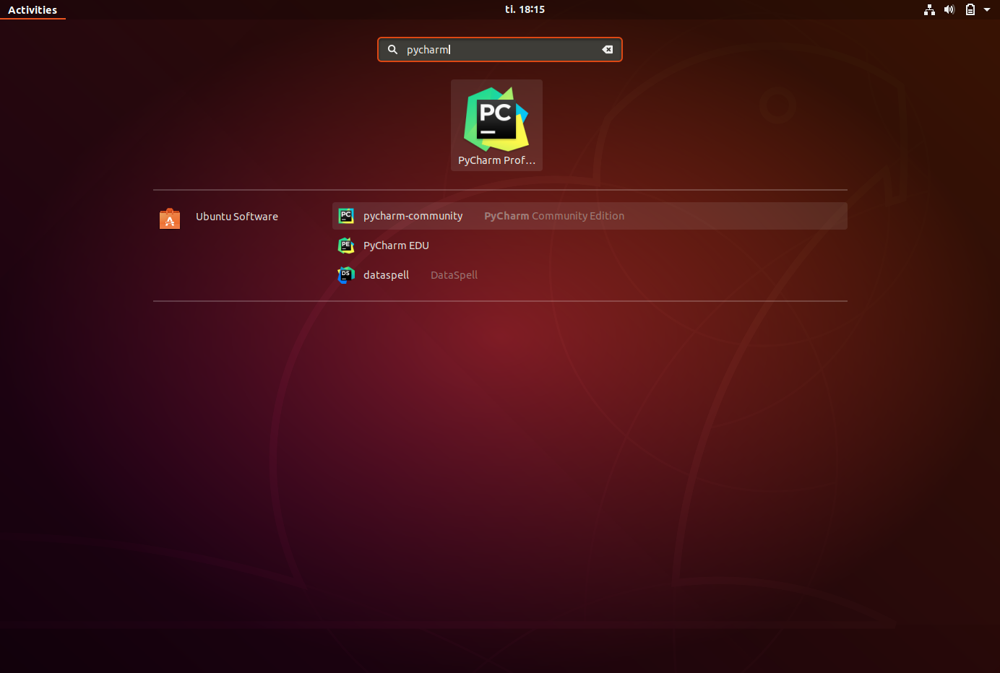
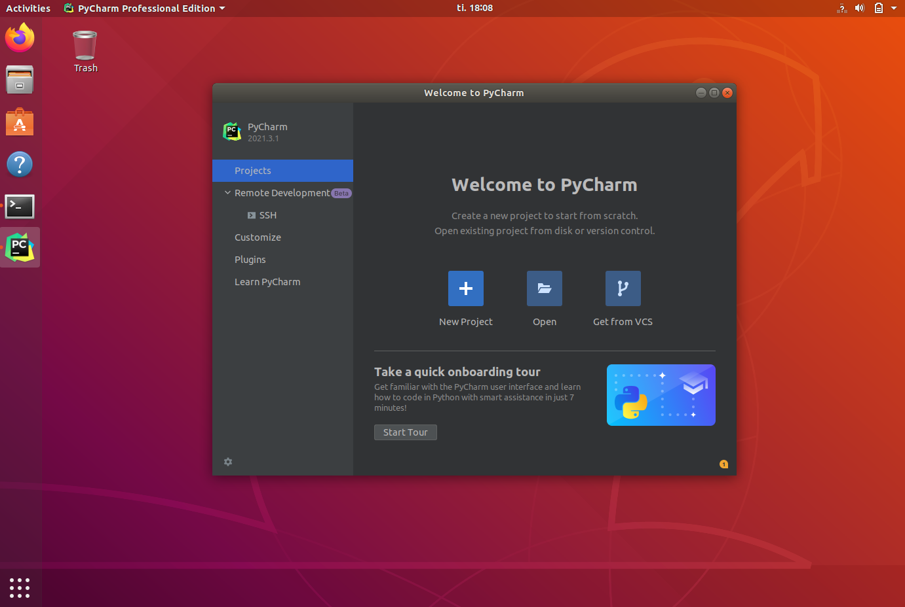
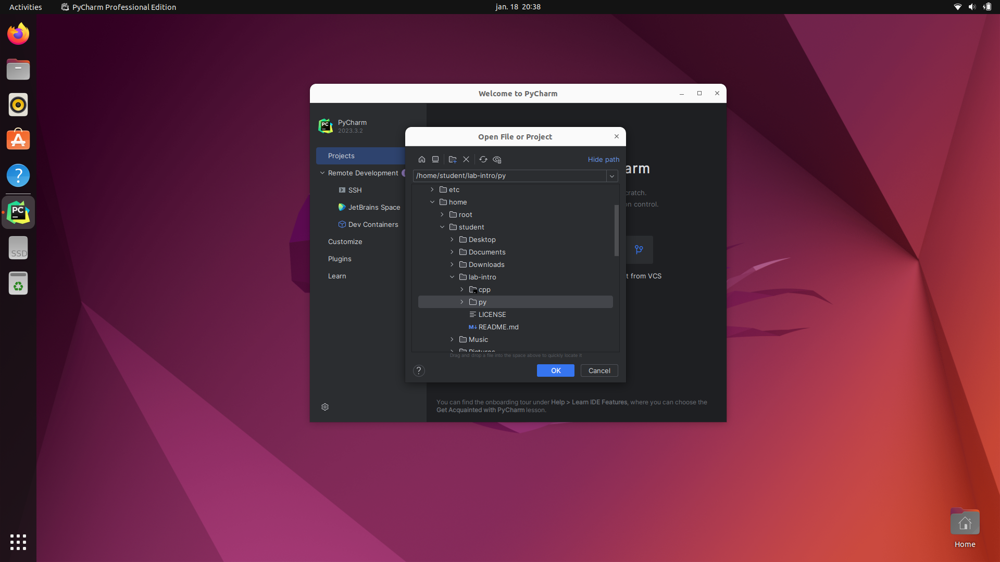
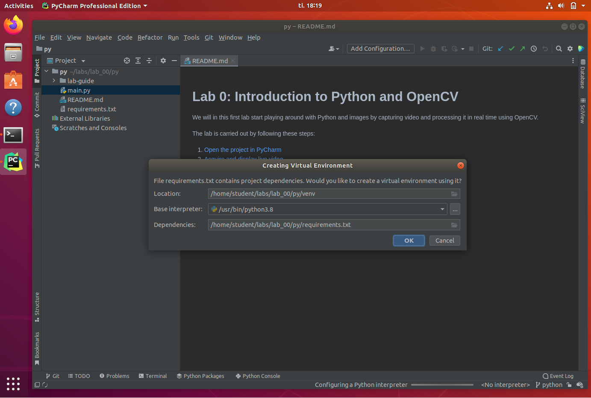
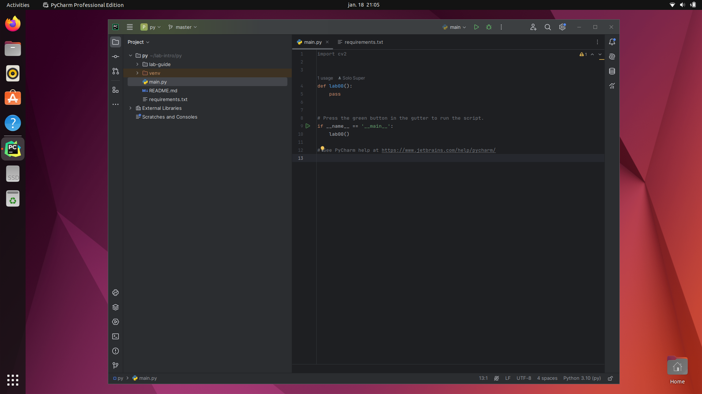

# Step 1: Open the project in PyCharm
We will in this part download the code from the course repository, and open the project in PyCharm.
Feel free to use another editor if you want to!

## 0. Make sure that we have Python 3 and git installed
If you do not have Python installed, please follow the instructions on [python.org/downloads](https://www.python.org/downloads/) to obtain your copy.

Also make sure that you have [git](https://git-scm.com/install/) installed, either as part of your editor or standalone.

## 1. Clone the code
Clone the lab code from https://github.com/tek5030/lab-intro.
We can for example clone the lab under this directory by typing the following in the terminal:
```bash
git clone https://github.com/tek5030/lab-intro
```
You should now find the code and this lab guide in `./lab-intro`.
The C++ version is in the subfolder called `cpp`,
and the Python version in the subfolder called `py`. 

## 2. Open PyCharm
We will use PyCharm as IDE in the labs.
As a student, you can get it for free from [https://www.jetbrains.com/pycharm](https://www.jetbrains.com/pycharm).



Open PyCharm by pressing <kbd>⊞ Win</kbd> and type `pycharm`. Press <kbd>Enter</kbd>.

## 3. Choose "Open project"


## 4. Find and open the lab project
Open the `py` folder in the lab directory.

Choose **Open as Project**, and **Trust Project** if a dialog appears.

PyCharm should discover our `requirements.txt` and offer to create a virtual environment based on our Python interpreter.
Press OK.

You can also create a virtual environment and install the requirements manually on the command line like this (on Linux):
```bash
python -m venv venv
source venv/bin/activate
pip install -r requirements.txt
```






## 5. We are ready to do some programming!


We are now ready to continue to [the next step](2-acquire-and-display-live-video.md).
