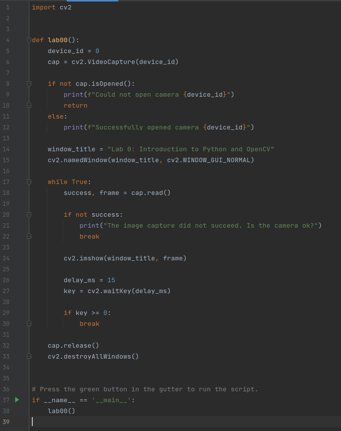

# Step 2: Acquire and display live video
We will in this part use OpenCV to capture and display live video from your camera.

## 1. Write the code
Write the following code in `main.py`.   
(Yes, it is intentional that you cannot copy it directly...)



If you are using Windows, you should configure VideoCapture like this:
```python
cap = cv2.VideoCapture(device_id, cv2.CAP_DSHOW)
```
This will avoid it hanging for several seconds before the stream is ready.

## 2. Run the code
You can run/debug the code by pressing `Ctrl + Shift + F10/F9`.

You should now see live video streaming from your camera!

## 3. Reflect
Read the code.   
What does it do?   
Please ask the instructors if you have questions!   

When you get the code to run, and are finished playing around with it, contine to the [last step](3-processing-live-video.md).
