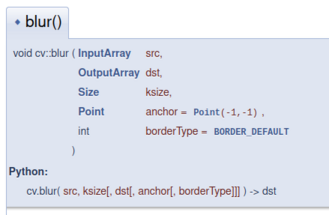

# Step 3: Processing live video
Lets do some cool stuff by processing each `frame`!

## Some suggestions
- Apply blurring to each frame with [`cv::blur`][opencv-blur]
- Extract edges from each frame with [`cv::Canny`][opencv-canny]
- Take the [difference] between two successive images.

## Play around further!
- Take a look at the [OpenCV documentation][opencv-docs]

   Note that the OpenCV documentation is primarily focused on C++, but most functions include the python signature also:

  

- Try the [OpenCV tutorials][opencv-tutorials]
  - [The Core Operations][opencv-core]
  - [Image Processing][opencv-imgproc]

Congratulations!
You have just finished your first lab in TEK5030!

## Useful resources
Please read our [introduction to C++ and OpenCV](resources/TEK5030-Compendium.pdf)!

- C++
  - C++ reference: [http://en.cppreference.com/w/](http://en.cppreference.com/w/)
- OpenCV
  - Documentation: [https://docs.opencv.org/4.9.0][opencv-docs]
  - Tutorials: [https://docs.opencv.org/4.9.0/d6/d00/tutorial_py_root.html][opencv-tutorials]
- CLion
  - Documentation: [https://www.jetbrains.com/clion/documentation/][clion-docs]
  - Reference card: [https://resources.jetbrains.com/storage/products/clion/docs/CLion_ReferenceCard.pdf][clion-refcard]
- PyCharm
  - Learn PyCharm: [https://www.jetbrains.com/pycharm/learn/][pycharm-docs]
  - Reference card: [https://resources.jetbrains.com/storage/products/pycharm/docs/PyCharm_ReferenceCard.pdf][pycharm-refcard]

[opencv-blur]: https://docs.opencv.org/4.9.0/d4/d86/group__imgproc__filter.html#ga8c45db9afe636703801b0b2e440fce37
[opencv-canny]: https://docs.opencv.org/4.9.0/dd/d1a/group__imgproc__feature.html#ga04723e007ed888ddf11d9ba04e2232de
[difference]: https://docs.opencv.org/4.9.0/d2/de8/group__core__array.html
[opencv-docs]: https://docs.opencv.org/4.9.0/
[opencv-tutorials]: https://docs.opencv.org/4.9.0/d6/d00/tutorial_py_root.html
[opencv-core]: https://docs.opencv.org/4.9.0/d7/d16/tutorial_py_table_of_contents_core.html
[opencv-imgproc]: https://docs.opencv.org/4.9.0/d2/d96/tutorial_py_table_of_contents_imgproc.html
[clion-docs]: https://www.jetbrains.com/clion/documentation/
[clion-refcard]: https://resources.jetbrains.com/storage/products/clion/docs/CLion_ReferenceCard.pdf
[pycharm-docs]: https://www.jetbrains.com/pycharm/learn/
[pycharm-refcard]: https://resources.jetbrains.com/storage/products/pycharm/docs/PyCharm_ReferenceCard.pdf
